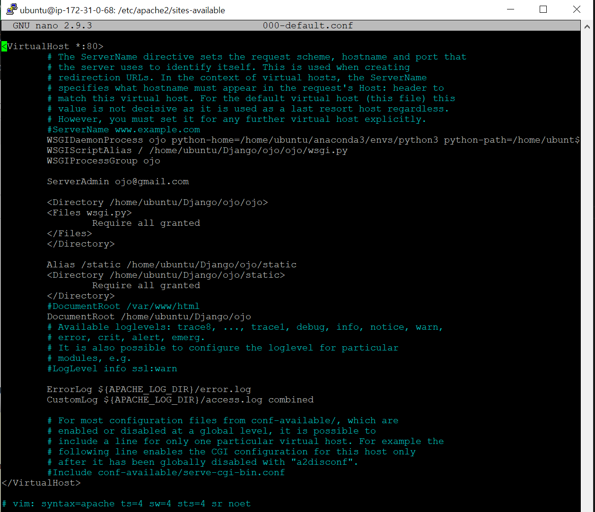

## :: AWS EC2 인스턴스에서 Apache로 Django Deploy하기


Django를 AWS EC2에서 설치하고 작업했기 때문에 바로 Apache 서버 구성


### Apache 서버 구성

- nano/vim 편집기를 열어 파일 편집

```shell
$ sudo nano /etc/apache2/sites-available/000-default.conf
```


- 파일수정

```
<VirtualHost *:80>
ServerAdmin webmaster@example.com
DocumentRoot /home/ubuntu/django/myproject
ErrorLog ${APACHE_LOG_DIR}/error.log
CustomLog ${APACHE_LOG_DIR}/access.log combined
Alias /static /home/ubuntu/django/myproject/static
<Directory /home/ubuntu/django/myproject/static>
Require all granted
</Directory>
<Directory /home/ubuntu/django/myproject/myproject>
<Files wsgi.py>
Require all granted
</Files>
</Directory>
WSGIDaemonProcess myproject python-path=/home/ubuntu/django/myproject python-home=/home/ubuntu/django/myprojectenv
WSGIProcessGroup myproject
WSGIScriptAlias / /home/ubuntu/django/myproject/myproject/wsgi.py
</VirtualHost>
```




- django 프로젝트 디렉토리로 이동

```shell
$ cd /home/ubuntu/Django/ojo

# 추가 작업
$ chmod 664 db.sqlite3
$ sudo chown :www-data db.sqlite3
$ sudo chown :www-data ~/ojo
```


- ojo(myproject) 프로젝트에서 settings.py에서 **DEBUG = False **로 변경

```python
DEBUG = False
```


- 아파치 재시작

```sh
$ sudo service apache2 restart
```


- 브라우저에서 인스턴스 public IP로 이동하여 실제 웹 배포 확인


