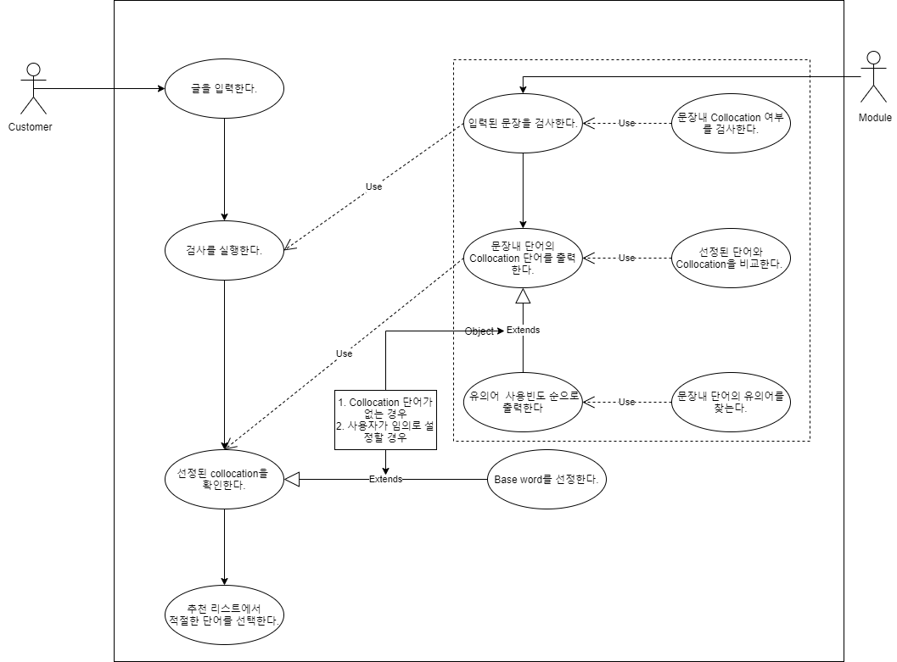
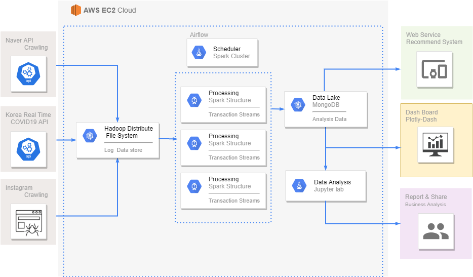

# MultiCampus Final Project

### Data Engineer  + Data Science 통합 프로젝트

#### 1. Project 소개

**프로젝트 팀명** : OJO

**프로젝트 주제** :  코로나 시대, 안전여행을 위한 SNS데이터 활용 감성숙소 추천 시스템

**프로젝트 수행 도구** : AWS EC2 (Ubuntu), Anaconda, Nosql(mongodb), VScode, PuTTY

**프로젝트 목적** :  코로나 장기화로 인한 국내여행 활성화에 따른, 코로나 시대 안전여행을 위한 SNS데이터
							활용 지방 분산형 감성숙소 추천

**포함 기술** : 

1. 수집 : Crawling, openAPI
2.  처리 :Spark
3.  저장 : HDFS, MongoDB
4.  시각화 : plotly/Dash
5.  web service : Django  

#### 2.  Usecase 정의서

#### 3. DFD (Data Flow Diagram)

